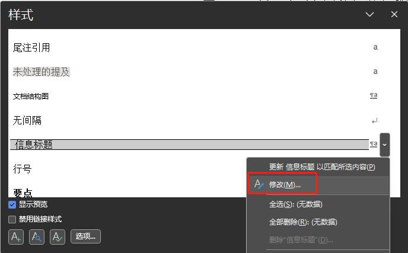
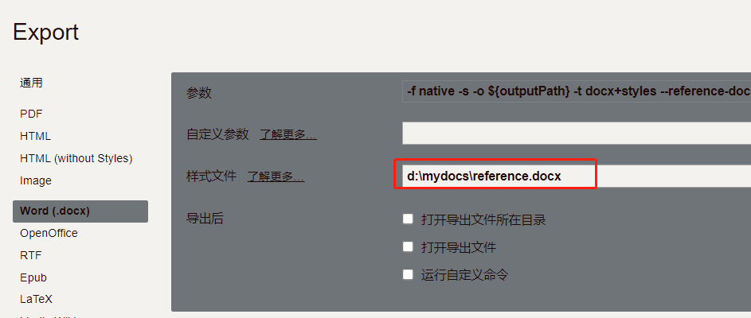

## Typora Docx Reference模板

平时用Typora写markdown文档，在某些情况下，这些md文档需要被转成Word docx格式。默认的格式实在是没眼看啊，改都无从改起。终于搞了一个能基本用起来的pandoc word reference 模板。

### 用法：


- 用Word打开`[reference.docx](./reference.docx)`文件，按下样式编辑快捷键`Shift+Ctrl+Alt+S`，根据自己的喜好修改样式。

  
  
- 使用Typora导出.docx文件时，需要在【文件】-【偏好设置】-【导出】-【Word(.docx)】里，指定样式文件为 reference.docx。
  
  然后在Typora里，执行导出.docx文件即可。
  
  
  
- 使用pandoc命令行时，在命令行里指定reference文件的位置即可。
  ```bash
   pandoc -o your_filename.docx -f markdown  -t docx+styles --reference-doc=reference.docx --verbose your_markdown_filename.md
  ```

### 已知问题：

- 如果你的md文档里有mermaid格式的流程图，那最好还是用Typora给你导出，pandoc命令行的话，要额外安装支持mermaid的filter。
- 导出成Word格式时，各种md支持的自定义风格写法，都是没法转成Word格式的。这个我也没搞掂，希望有高人指点。
- md里的表格，转成word的表格时，格式一塌糊涂。现在的版本也就是勉强能看，不是很完美。 