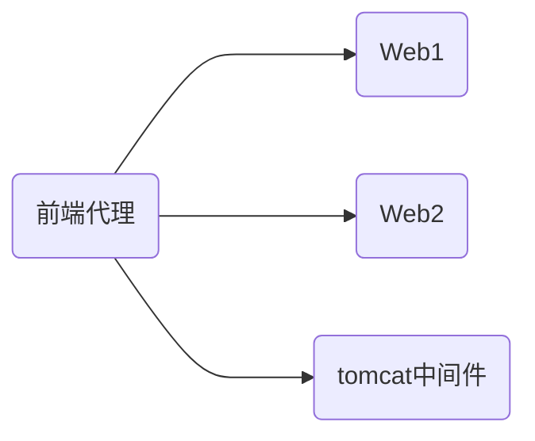

---
# 文件的自定义属性
title: "文档标题"
author: FirstName LastName
keywords:
  - Typora 
  - Pandoc
  - Word
lang: zh-CN
output:
  word_document:
    reference_docx: "reference.docx"
---


# 入门

如果您对Apache HTTP Server完全陌生，甚至根本不熟悉网站，那么您可能不知道从哪里开始或要问什么问题。本文档将向您介绍基础知识。

## 客户端，服务器和URL

网络上的地址用URL（统一资源定位符）表示，URL指定协议（例如`http`），服务器名（例如 `www.apache.org`），URL路径（例如 `/docs/current/getting-started.html`）以及可能`?arg=value`用于将其他参数传递给服务器的查询字符串（例如）。服务器。

### 客户端

客户端（例如Web浏览器）使用指定的协议连接到服务器（例如Apache HTTP Server），并使用URL路径**请求**资源。

URL路径可以代表服务器上的任何事物。它可能是文件（如`getting-started.html`），处理程序（如[server-status](https://www.apachehttpd.com/mod/mod_status.html)）或某种程序文件（如`index.php`）。我们将在下面的“ [网站内容”](https://www.apachehttpd.com/getting-started.html#content)部分中进行更多讨论。

### 服务器端
服务器将发送一个**响应**，该**响应**由状态码和（可选）响应主体组成。状态码指示请求是否成功，如果失败，则指示错误类型。这告诉客户端应如何处理响应。您可以在[HTTP Server Wiki中](http://wiki.apache.org/httpd/CommonHTTPStatusCodes)阅读有关可能的响应代码的信息 。

事务的详细信息以及任何错误情况都写入日志文件。下面在“[日志文件和故障排除”](https://www.apachehttpd.com/getting-started.html#logs)部分中对此进行了更详细的讨论。

## 主机名和DNS

为了连接到服务器，客户端首先必须将服务器名称解析为IP地址-服务器在Internet上的位置。因此，为了使您的Web服务器可访问，服务器名必须在DNS中。

如果您不知道如何执行此操作，则需要与网络管理员或Internet服务提供商联系，以执行此步骤。

一个以上的主机名可能指向同一IP地址，并且一个以上的IP地址可以连接到同一台物理服务器。因此，您可以使用称为[虚拟主机](https://www.apachehttpd.com/vhosts/)的功能在同一台物理服务器上运行多个网站。

如果要测试不可通过Internet访问的服务器，则可以在主机文件中放入主机名，以便进行本地解析。例如，`www.example.com`出于测试目的，您可能希望在主机文件中放置一条记录，以将请求映射到本地系统。此项看起来像：

```
127.0.0.1 www.example.com
```

主机文件可能位于`/etc/hosts`或 `C:\Windows\system32\drivers\etc\hosts`。

## 代码框
以下为代码框示例
```bash
#!/usr/bin/bash
...
while read logentry
do
   f3=$(echo "$logentry" | cut -d\" -f3)
      returncode="$(echo $f3 | cut -f1 -d\  )"
      bytes="$(echo $f3 | cut -f2 -d\  )"
if [ $returncode != "200" ] ; then
     echo "$returncode ($entry): $logentry"
   fi
entry=$(( $entry + 1 ))
done < $accesslog

```


## 引用

以下为引用的内容：

> 这不是“问答”部分。此处放置的评论应指向有关改进文档或服务器的建议，如果实施或被认为无效/偏离主题，我们的主持人可以将其删除。有关如何管理Apache HTTP Server的问题，应直接指向我们的IRC频道#httpd（位于Freenode上），或发送至我们的邮件列表

## 流程图

本节展示mermaid示意图：



## 表格示例

展示表格样式：

| <span style="display: inline-block; width:100px">Apache版本</span> | <span style="display: inline-block; width:200px">支持的平台</span>| 架构          |
| :------------------------------------------------------------: | :----------------------- | :------------- |
| 2.2                                                          | Linux/Windows/HP-UX/AIX | x86,x86/64... |
| 2.4                                                          | Linux/Windows           | x86,x86/64... |


## 公式输入

$$
\begin{align*}
y = y(x,t) &= A e^{i\theta} \\
&= A (\cos \theta + i \sin \theta) \\
&= A (\cos(kx - \omega t) + i \sin(kx - \omega t)) \\
&= A\cos(kx - \omega t) + i A\sin(kx - \omega t)  \\
&= A\cos \Big(\frac{2\pi}{\lambda}x - \frac{2\pi v}{\lambda} t \Big) + i A\sin \Big(\frac{2\pi}{\lambda}x - \frac{2\pi v}{\lambda} t \Big)  \\
&= A\cos \frac{2\pi}{\lambda} (x - v t) + i A\sin \frac{2\pi}{\lambda} (x - v t)
\end{align*}
$$


## 自定义区块风格

<span style="color:green;font-weight:700;font-size:20px">行内自定义风格。但这个风格定义在word导出时会失效。
</span>

<div style="color:red;font-weight:700;font-size:20px">
段内自定义风格。  <p>
但这个风格定义在word导出时会失效。
</div>
